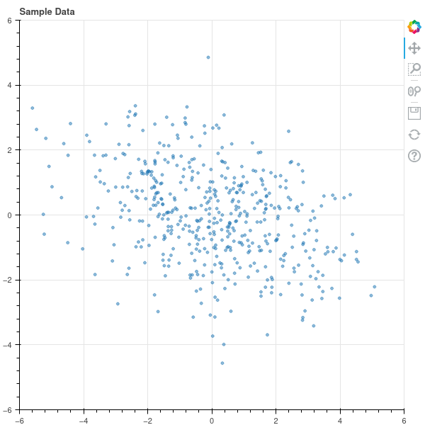
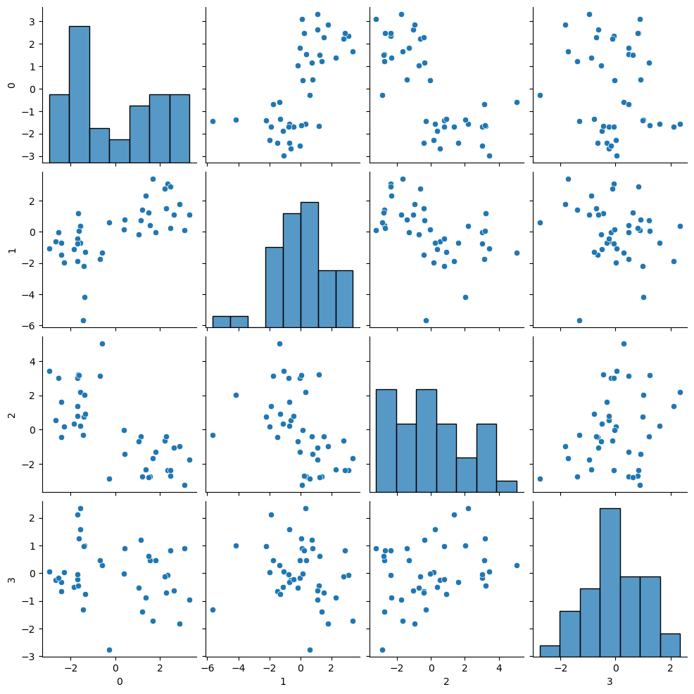
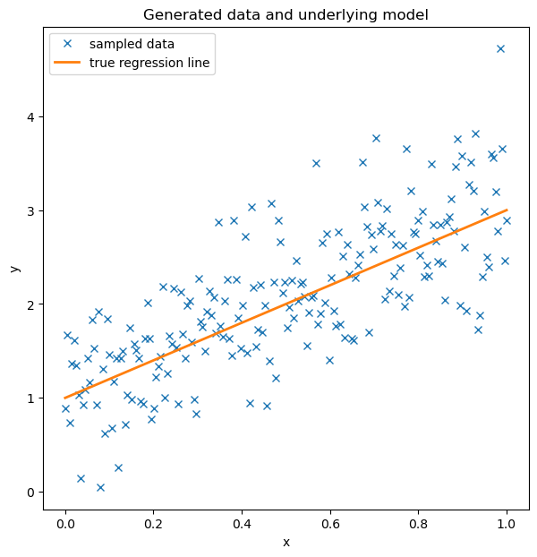

# Introduction

## What is Data Science/Machine Learning/AI?

An interdisciplinary field that combines theory and practice
from

- Mathematics
- Computer Science
- Statistics

to extract patterns from data, predict the behavior of complex systems,
and generate responses to input that capture aspects of human behavior.

## The role of mathematics

Both Statistics and Computer Science grew out of Mathematics.

Mathematics seeks:

- abstraction: finding the simplest underlying framework for expressing
the phenomena of interest
- generality: establishing results in the broadest possible framework
- rigor: establishing the truth of results through logical reasoning

## Theorems

A *theorem* is a mathematical statement that is established by deductive proof.

**Theorem:** The sum of two odd numbers is even.

**Proof:** Let $a$ and $b$ be odd numbers.  Then $a=2k+1$ and $b=2s+1$ where $k$ and $s$ are some
integers.  Then $a+b=2k+2s+1+1=2k+2s+2=2(k+s+1)$.  Since $a+b$ is a multiple of $2$, it is even.

**Theorem:** Let $A$ and $B$ be the lengths of the sides of a right triangle, and $C$ be the length of its hypotenuse. Then $C^2=A^2+B^2$.

## Three theorems at the heart of Data Science

- The Spectral Theorem
- Bayes's Theorem
- The Chain Rule

# The spectral theorem

## The spectral theorem

**Theorem:** Let $D$ be a real $n\times n$ symmetric matrix.  Then:

- there are real numbers $\lambda_n\ge \lambda_{n-1}\ge\cdots\ge\lambda_{1}$ and linearly independent vectors $v_n,\ldots, v_1$ in $\mathbf{R}^{n}$ such that $Dv_{i}=\lambda_{i}v_{i}$. 
- If $\lambda_{i}\not=\lambda_{j}$, then $v_{i}$ and $v_{j}$ are orthogonal.
- there is an orthonormal basis $u_1,\ldots, u_n$ for $\mathbb{R}^{n}$ such that $Du_{i}=\lambda_{i}u_{i}$.
- if $P$ is the matrix whose columns are the $u_{i}$, then $PP^{\intercal}=I$ and $P^{\intercal}DP$ is
the diagonal matrix $\Lambda$ whose diagonal entries are the $\lambda_{i}$.

## Application in Data Science

Suppose that $X$ is an $N\times k$ data matrix with $N$ sample points each having $k$ real valued features.

We want to generate new features by combining the existing features

The new features are sometimes called scores 

Example: class score is weighted sum of scores on individual assignments:
$$
S = w_1 f_1 + w_2 f_2 +\cdots w_k f_k
$$

Which scores are most informative?  Those that "spread out the data" the most.

## Some data


{width=250}

## Covariance matrix

Assume that the features all have mean value zero.  The *covariance matrix* of the data is 

$$
D=\frac{1}{N}X^{\intercal}X.
$$
It is symmetric.

For the data above this matrix is 
$$
D=\left(\begin{matrix} 4.32 & -1.2 \\ -1.2 & 2.16\end{matrix}\right)
$$

## Spectral theorem in this case

The $\lambda$'s are $\lambda_1=4.85$ and $\lambda_2=1.63$.

The matrix $P$ is
$$
P= \left(\begin{matrix} -0.41 & -0.91 \\
 -0.91 &  0.41 \end{matrix}\right)
$$

## The orthogonal eigenvectors 

The orthonormal vectors (eigenvectors) are the "natural coordinates" for the data. 

{width=250}

## Dimensionality Reduction

The "directions" with the largest eigenvalues capture the "most interesting" part of the data.   Suppose we have 40 data points with 4 features.

{width=250}

## Use the two "directions" with largest eigenvalues

{width=250}

# Bayes's Theorem


## Bayesian perspective

Our life experiences (and maybe our genetics) give us a set of "prior probabilities" for judging truth or falsehood or evaluating likelihood in the world.

When confronted with a new event, we re-evaluate these prior probabilities and update them.

**Example:** I move to CT from Colorado where it is very dry.  When I go on a hike, I don't expect rain (my "prior probability for rain" is low).  So I don't bring a raincoat.  But it rains a lot in CT, and each time it does, I update my sense of the chance of getting rained on to treat it as more likely; eventually I decide that when I hike in CT I need to bring a raincoat. 

## Bayes's Theorem

**Theorem:** Let $A$ and $B$ be events in a probability space.  Then

$$
P(A|B)=\frac{P(B|A)P(A)}{P(B)}
$$

where $P(A|B)$ is the conditional probability of $A$ given $B$.

## Bayes Theorem - a simple example

Suppose we wish to understand how something like a vaccine reduces the risk of death
from (hypothetically speaking) a new respiratory virus.

In other words, we are interested in comparing:

- the probability of death from the virus in the population at large
- the difference in the probability of death between those vaccinated and those not.


## The 2x2 grid

From a population of 10000 people (note: these are totally made up numbers)

|        |Lived           |Died          | Totals          |
|--------|----------------|--------------|-----------------|
|Vaccinated|       7450        |   50           | 7500     |
|Unvaccinated|     2470        |   30           | 2500     |
|Totals     |          9820    |  80            | 10000    |

Here if $V$ is the event "vaccinated" and "D" is the event died, we have
$P(D|V)=50/7500=.6\%$ while $P(D)=.8\%$ and $P(D|~V)=1.2\%$. 

## More on the grid

Notice that:

- more vaccinated people died than unvaccinated people, but
- you are twice as likely to die if you are unvaccinated than if you are vaccinated.

Also
$$
P(D|V)=\frac{P(V|D)P(D)}{P(V)}=(.625)(.008)/(.75)
$$

The chance of dying is $.8\%$; but if you "learn" that someone is vaccinated, you can improve
that estimate to $.6\%$.

## Sampling methods and learning

Suppose we wish to build a system that recognizes pictures of cats; and, to begin with, we have a large data set of images marked as "cat" or "not cat".  Call this our dataset $D$.

Our system is a mathematical model or function $F$ that depends on a bunch of parameters $\Theta$. We have a prior distribution $P(\Theta)$ on $\Theta$ that represents some kind of initial guess about the parameters (like, say, the $\Theta$
are clustered around zero).

## Sampling continued

A sampling method uses Bayes Theorem in the form:

$$
P(\Theta|D)\propto  P(D|\Theta)P(\Theta)
$$

Here $P(D|\Theta)$ is the probability that our parameters $\Theta$ predict the given data $D$.  $P(\Theta|D)$
is the updated probability distribution on $\Theta$ taking the values $D$ into account.

A Monte Carlo sampler draws samples from $P(\Theta|D)$ (the "posterior distribution") based on $D$; these give
better information about $\Theta$ in light of the data.

## Example



A linear regression model fit to sample data.

## The posterior distribution on the slope


The distribution $P(\mathrm{slope}|\mathrm{data})$.

# The Chain Rule

## The Chain Rule

Let $F:\mathbf{R}^{n}\to \mathbf{R}^{m}$ and $G:\mathbf{R}^{m}\to \mathbf{R}^{k}$ be differentiable functions
at a points $x_0\in \mathbf{R}^{n}$ and $x_1=F(x_0)\in\mathbf{R}^{m}$.  Then
$$
D_{x_{0}}(G\circ F)=D_{x_{1}}(G)D_{x_{0}}(F).
$$

## First Application

Let $F:\mathbf{R}^{n}\to \mathbf{R}$ be a function of $n$ variables x_1,\ldots, x_n.  Then the gradient vector
$$
\nabla F = \left[\begin{matrix} \frac{\partial F}{x_{1}} & \cdots & \frac{\partial F}{x_{n}}\end{matrix}\right]
$$
points in the direction of most rapid increase of $F$.

**Proof:** Consider
$$
\frac{d}{dt}F(\mathbf{x}+t\mathbf{v})|_{t=0}=\nabla F\cdot \mathbf{v}
$$
which measures the rate of change of $F$ as you travel in with velocity $v$. If $\|\mathbf{v}\|^2=1$ (so you travel at speeed one) this is maximal when $\mathbf{v}$ points in the direction of $\nabla F$.


## Gradient Ascent/Descent

Similarly, $F$ decreases most rapidly if you move in the direction of $-\nabla F$. 

A machine learning algorithm is typically a complicated function $F(x;u)$ where $x$ is the data and $u$
are a set of unknown parameters.  The "goodness" of our function is controlled by a "loss" or "error"
function $L(x;u)$.  We try to adjust the weights $u$ to minimize this. 

**Algorithm:** (Gradient Descent) Iteratively compute the gradient $\nabla L$ of $L$ with respect to the variables $u$, and then repeatedly modify $u$ by a small multiple of the gradient, reducing $L$ at each step, until this process stabilizes.

##


[Animation](https://jeremy9959.net/GDanimate.html) 

## Gradient Descent in Deep Learning

A deep learning algorithm is a composition of a sequence of linear and nonlinear operations:

$$
F(x;u)=L_1(u_1)\circ L_2(u_2)\circ\cdots\circ L_n(u_n)
$$

To optimize $F(x;u)$ we apply some version of gradient descent to minimize the "loss" function by varying
the $u_i$.

Deep learning software like pytorch can compute the chain rule "automatically".

## Example

Least Squares Via Torch

- Loss is MSE
- Model is z=wx+b
- Derivative of MSE with respect to w is $$\frac{-2}{10}\sum_{i=1}^{10} (z_i-wx_i-b)x_i$$

## Code

```python
x_data = torch.tensor(x.reshape(10,1))
w=torch.rand(1,1,dtype=torch.float64,requires_grad=True)
b=torch.rand(1,1,dtype=torch.float64,requires_grad=True)
y_data = torch.tensor(y.reshape(10,1))
z_data=torch.matmul(x_data,w)+b
loss = torch.nn.functional.mse_loss(z_data,y_data)
```


## Results

```python
print(torch.sum(-2*(z_data-y_data)*x_data)/10)
```
and

```python
loss.backward()
print(w.grad)
```

are the same.
